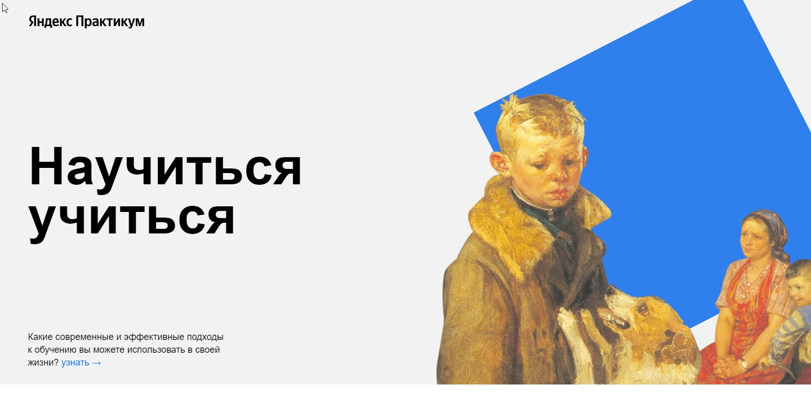

<h1>Проект "Научиться учиться"</h1>

<h2>Яндекс практикум "Веб-разработка"(Спринт 1 и спринт 2)</h2>
<h3>Применялись языки разметки :<h3>
*** HTML:5 и CSS. ***
 ## В проекте задействованы технологи:
1. Flexbox;
2. БЭМ;
3. Позиционирование;
4. Iframe;
5. Анимация и трансформация;
6. Плавность перехода;

